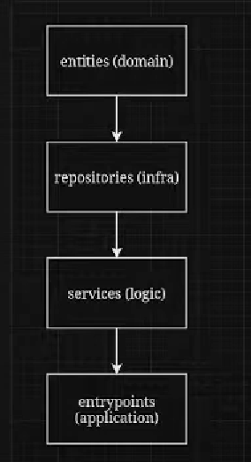

DDD сервис, который считывает ивенты и срет их в кафку, а потом из кафки отправлять их в Вебсокеты


общим подходом в DDD для организации и упрощения взаимодействия между компонентами системы является использование медиатора вместе с контейнером для управления зависимостями


## Основные концепции DDD и реализация структуры


В данном проекте мы следуем принципам Domain-Driven Design (DDD) для четкого разделения ответственности между компонентами. Структура проекта позволяет организовать код так, чтобы каждая часть отвечала за свою область, что значительно упрощает поддержку и расширение приложения. Ниже описаны уровни логики и их роль в системе.
1. **Entities (Сущности, Domain Logic) → Определяют бизнес-сущности и их правила.**
2. **Repositories (Репозитории, Infrastructure Logic) → Доступ к данным.**
3. **Services (Сервисы, Business Logic) → Операции, которые выходят за рамки одной сущности.** Сервис не имеет собственного состояния; он выполняет действие.
4. **Entrypoints (Точки входа, Application Logic) → Контроллеры, обработчики, API.**

🔹 Где находится предметная область (Domain)?  
👉 Сущности (Entities) и агрегаты (Aggregates) находятся в домене.

✨ Итак, что определяет предметную область в DDD?  
✅ Сущности (Entities) – основа, но они не единственные.  
✅ Агрегаты – группируют сущности и управляют их целостностью.  
✅ Value Objects – определяют значения без идентичности.  
✅ Доменные сервисы – обрабатывают логику, выходящую за рамки одной сущности.  
✅ Доменные события – фиксируют изменения в бизнес-логике.  
✅ Use Cases – управляют последовательностью действий в системе.  

- Но репозиторий не определяет предметную область – он лишь служит способом взаимодействия доменных объектов с хранилищем данных.

Начинаем с создания ентитей
потом закидуем в репозиторий
с этими репозиторями делаем какую-то бизнесс логику
ее отрпавляем в приложение

домен знает об ивенте, а ивент об домене - нет, т.е.
в методах ентиттей(доменная область) высирать ивенты,
а потом в логике(сервисах) их ловить и обрабатывать.

что такое ентити и как они могут быть несвязаны с доменом?
как это может быть домен цетральной сущностью и он не знает ни о чем,
а ивента накапривать в use кейсе... что такое юз кейс?

[Ответ в по ссылке](./imgs_expl/ddd_entities_usecases.md)


## Чем отличаются Value Objects от Сущностей?
Основное различие между **Сущностями (Entities)** и **Объектами-значениями (Value Objects)** заключается в их идентичности и изменяемости:

- **Сущности (Entities):**
  - **Идентичность:** Каждая сущность имеет уникальный идентификатор (например, `id`). Даже если две сущности имеют одинаковые свойства, они считаются разными, если их идентификаторы различаются.
  - **Изменяемость:** Сущности могут изменять своё состояние в течение жизненного цикла.

  *Пример:* Пользователь (`User`) с уникальным `ID`, который может менять своё имя или email.

- **Объекты-значения (Value Objects):**
  - **Идентичность:** Не имеют уникального идентификатора. Два объекта-значения считаются одинаковыми, если их свойства совпадают.
  - **Неизменяемость:** После создания их состояние не изменяется. Если нужно изменить значение, создаётся новый объект.

  *Пример:* `Address` с полями `street`, `city`, `zipcode`. Два адреса считаются одинаковыми, если все их поля совпадают.

Таким образом, сущности важны своей уникальностью, а объекты-значения — набором своих свойств.
   
### Зачем такая структура

Эта структура позволяет легко масштабировать проект, добавляя новые функциональные компоненты, не нарушая других частей приложения. Четкое разделение уровней логики — доменная, инфраструктурная, бизнесовая и прикладная — делает приложение гибким и удобным в поддержке. Каждый уровень выполняет свою задачу независимо от других, что упрощает тестирование и внесение изменений.


----
# Команда - Причина, Ивент - Следствие

1. **Команда — это Причина:**
   - Команда запускает выполнение конкретного действия.
   - Это активное намерение совершить действие, изменение состояния.
     - `CreateChatCommand` — команда для создания нового чата.
     - `CreateMessageCommand` — команда для создания нового сообщения.

2. **Ивент — это Следствие:**
   - Ивент фиксирует, что действие, инициированное командой, произошло.
   - Это уведомление о том, что событие состоялось, и сигнал для других компонентов системы реагировать.
     - `NewChatCreatedEvent` — ивент, который фиксирует создание нового чата.
     - `NewMessageReceivedEvent` — ивент, который фиксирует получение нового сообщения.

Таким образом:

- **Команда** запускает процесс.
- **Ивент** фиксирует его завершение и, возможно, инициирует последующую реакцию в других частях системы.

> Команда инициализирует изменения, а ивент подтверждает, что эти изменения произошли, помогая другим системам адаптироваться и реагировать на изменения.

---
# Медиатор - Принцип Работы и Последовательность Выполнения

### Роль Медиатора

Медиатор является ключевым компонентом для связывания **команд** и **событий** с их соответствующими обработчиками. Его задача — управлять и координировать взаимодействие между разными компонентами, чтобы команды и события могли найти своих обработчиков и произвести нужные действия.

Медиатор поддерживает два основных типа карт:

- `events_map` — словарь, который связывает события с их обработчиками.
- `commands_map` — словарь, который связывает команды с их обработчиками.

### Основные Методы Медиатора

1. **`register_event`** - регистрация обработчиков событий.
2. **`register_command`** - регистрация обработчиков команд.
3. **`publish_event`** - публикация и обработка событий.
4. **`handle_command`** - обработка команд.

### Последовательность Выполнения Работы Медиатора

1. **Регистрация Обработчиков Событий и Команд**:
   - Перед тем, как использовать события и команды, медиатор должен зарегистрировать обработчики с помощью методов `register_event` и `register_command`.
   - Например, используя `register_event`, медиатор добавляет обработчик в `events_map` для соответствующего типа событий, чтобы потом знать, кто отвечает за обработку этого события.

2. **Публикация Событий (`publish_event`)**:
   - Когда происходит событие (например, создание нового чата или сообщение), оно передается в метод `publish_event`.
   - Медиатор находит всех обработчиков, которые зарегистрированы для данного типа события, и вызывает их для обработки.
   - В этом случае публикация событий может быть асинхронной и отправляться в систему, такую как **Kafka**, для дальнейшего использования другими компонентами системы.
   - Если нет зарегистрированных обработчиков для данного типа события, вызывается исключение `EventHandlersNotRegisteredException`.

3. **Обработка Команд (`handle_command`)**:
   - Когда поступает команда (например, создание нового чата или нового сообщения), она передается в метод `handle_command`.
   - Медиатор находит всех обработчиков, зарегистрированных для данной команды, и вызывает их.
   - Обработка команд может быть также асинхронной, что позволяет выполнять действия без блокировки основного потока выполнения.
   - Если нет зарегистрированных обработчиков для данного типа команды, вызывается исключение `CommandHandlersNotRegisteredException`.

### Принцип Работы Медиатора

- **Медиатор** работает как координирующий центр, который знает, какие обработчики связаны с какими командами и событиями. 
- Весь процесс можно представить следующим образом:

  1. **Регистрация**: Обработчики команд и событий сначала регистрируются в медиаторе. Таким образом, медиатор знает, к каким событиям и командам привязаны соответствующие обработчики.
  2. **Обработка Команд**: Когда клиент инициирует команду, медиатор вызывает соответствующие обработчики для выполнения необходимого действия. Например, при вызове `CreateChatCommand`, медиатор вызывает `CreateChatCommandHandler`.
  3. **Публикация Событий**: После выполнения команды могут возникать события, которые необходимо публиковать. Медиатор получает эти события и вызывает соответствующие обработчики для каждого события, например для уведомления других систем.

### Пример Последовательности Выполнения

1. **Клиент вызывает команду** `CreateChatCommand` через API для создания нового чата.
2. **Медиатор** вызывает `handle_command` и находит обработчик команды (`CreateChatCommandHandler`), который создает новый чат.
3. **Создается событие** `NewChatCreatedEvent` после успешного создания чата.
4. **Медиатор** публикует событие с помощью метода `publish_event`, вызывая обработчики, которые зарегистрированы для реакции на это событие (например, Kafka, которая уведомляет другие сервисы).

Таким образом, **медиатор** играет роль центрального компонента, который обеспечивает связь и взаимодействие между событиями и командами, делая систему более гибкой и масштабируемой.


---


# Структура Приложения с Комментариями к Шагам Вызова

В этой структуре приложения показано, как различные части приложения взаимодействуют друг с другом в рамках использования **медиатора**, **команд**, и **ивентов**. 

```plaintext
app/
│
├── application/
│   ├── api/
│   │   ├── dependencies/  # Модули с зависимостями, которые могут потребоваться в API (например, подключение к репозиториям, авторизация и т.д.)
│   │   └── messages/
│   │       ├── handlers.py  # Handlers для обработки API запросов на создание чатов и сообщений.
│   │       ├── schema.py    # Схемы данных, которые поступают от клиента (например, pydantic-схемы для валидации).
│   │       └── main.py      # Основной модуль, который запускает API FastAPI, включая регистрацию роутов.
│
├── domain/
│   ├── entities/            # Доменные сущности (например, `Chat`, `Message`), которые представляют бизнес-логику.
│   ├── events/              # Определения ивентов (например, `NewChatCreatedEvent`).
│   │   ├── base.py          # Базовый класс для всех ивентов.
│   │   └── messages.py      # Определения ивентов, связанных с сообщениями (например, `NewMessageReceivedEvent`).
│   ├── exceptions/          # Исключения, которые могут быть выброшены в случае ошибок.
│   └── values/              # Вспомогательные объекты значений, такие как `Title`, `Text`.
│
├── infra/
│   ├── repositories/        # Репозитории для сохранения данных (например, `Memory`, `Mongo`).
│
├── logic/
│   ├── commands/            # Команды и обработчики команд, которые определяют действия в системе.
│   │   ├── base.py          # Базовый класс для всех команд.
│   │   └── messages.py      # Определения команд, связанных с сообщениями (например, `CreateChatCommand`).
│   ├── events/              # Обработчики ивентов, которые определяют, что делать при получении определенного ивента.
│   │   ├── base.py          # Базовый класс для всех обработчиков ивентов.
│   │   └── messages.py      # Обработчики ивентов, связанных с сообщениями (например, `NewMessageReceivedHandler`).
│   └── exceptions/          # Исключения, связанные с логикой (например, ошибки медиатора).
│       ├── base.py          # Базовый класс для всех исключений.
│       ├── mediator.py      # Исключения, связанные с медиатором.
│       └── messages.py      # Исключения, связанные с логикой сообщений.
│
├── settings/                # Настройки приложения, включая конфигурацию Kafka, базы данных и прочее.
├── tests/                   # Тесты для проверок работы компонентов приложения.
└── docker_compose/          # Docker Compose файлы для поднятия инфраструктуры (Kafka, базы данных и т.д.)
```

## Последовательность Вызова (Рабочий Кейc)

1. **Клиент делает запрос на создание чата через API** (`POST /api/messages/create_chat`):
    - Модуль `main.py` в **`application/api/messages`** получает запрос и вызывает обработчик API из **`handlers.py`**.
    - **`handlers.py`** проверяет входные данные с использованием схемы из **`schema.py`** и создает команду `CreateChatCommand`.

2. **Команда `CreateChatCommand` передается медиатору**:
    - **`handlers.py`** передает команду в медиатор (который зарегистрирован в качестве зависимости в **`dependencies/`**).
    - В медиаторе вызывается метод `handle_command` для обработки команды.

3. **Медиатор вызывает соответствующий обработчик команды** (`CreateChatCommandHandler`):
    - Медиатор в **`logic/commands`** находит подходящий обработчик из **`CreateChatCommandHandler`** для обработки этой команды.
    - Обработчик команды (`CreateChatCommandHandler`) создает новый объект чата (`Chat`) в соответствии с бизнес-логикой, расположенной в **`domain/entities`**.

4. **Событие `NewChatCreatedEvent` создается и передается в медиатор**:
    - После создания чата, обработчик генерирует ивент (`NewChatCreatedEvent`), который добавляется в список ивентов объекта чата.
    - Медиатор с помощью метода `publish_event` обрабатывает все ивенты, связанные с созданием чата, находя соответствующих обработчиков ивентов.

5. **Публикация ивента в Kafka**:
    - В случае события `NewChatCreatedEvent`, медиатор вызывает метод `handle` соответствующего обработчика ивентов (`EventHandler`).
    - Этот обработчик может отправить информацию в **Kafka** (или другой брокер сообщений) для уведомления других микросервисов или частей системы о создании нового чата.

## Шаги Вызова в Контексте Компонентов

### 1. API (application/api/messages/main.py)
Получает HTTP-запрос от клиента и вызывает **handlers.py**.

### 2. Handlers (application/api/messages/handlers.py)
Создает команду и передает ее в **медиатор** для дальнейшей обработки.

Пример кода для `create_chat_handler`:

```python
@router.post(
    '/',
    response_model=CreateChatResponseSchema,
    status_code=status.HTTP_201_CREATED,
    description="Endpoint - Creating a new chat. If such chat by title already exists, return 400",
    responses={
        status.HTTP_201_CREATED: {"model": CreateChatResponseSchema},
        status.HTTP_400_BAD_REQUEST: {"model": ErrorSchema},
    }
)
async def create_chat_handler(schema: CreateChatRequestSchema, container=Depends(init_container)) -> CreateChatResponseSchema:
    mediator: Mediator = container.resolve(Mediator)

    try:
        chat, *_ = await mediator.handle_command(CreateChatCommand(title=schema.title))
    except ApplicationException as exception:
        raise HTTPException(status_code=status.HTTP_400_BAD_REQUEST, detail={"error": exception.message})
    return CreateChatResponseSchema.from_entity(chat)
```

### 3. Mediator (infra/logic/mediator.py)
Метод `handle_command` вызывает обработчик команды.

Пример кода для медиатора:

```python
async def handle_command(self, command: BaseCommand) -> Iterable[CR]:
    command_type = command.__class__
    handlers = self.commands_map.get(command_type)

    if not handlers:
        raise CommandHandlersNotRegisteredException(command_type)
    return [await handler.handle(command) for handler in handlers]
```

### 4. Command Handler (logic/commands/messages.py)
Обрабатывает команду (`CreateChatCommand`) и создает новый чат.

Пример кода для `CreateChatCommandHandler`:

```python
@dataclass(frozen=True)
class CreateChatCommandHandler(CommandHandler[CreateChatCommand, Chat]):
    chats_repository: BaseChatsRepository

    async def handle(self, command: CreateChatCommand) -> Chat:
        if await self.chats_repository.check_chat_exists_by_title(command.title):
            raise ChatWithThatTitleAlreadyExitsException(command.title)

        title = Title(value=command.title)
        new_chat = Chat.create_chat(title=title)
        self.chats_repository.add_chat(new_chat)

        return new_chat
```

## Комментарии по Рабочим Кейсам

1. **Регистрация Обработчиков**: В начале работы медиатор регистрирует обработчики команд и ивентов, чтобы позже можно было обрабатывать поступающие команды и события.

2. **Асинхронная Обработка**: Обработчики команд и ивентов могут быть асинхронными, что позволяет более эффективно обрабатывать входящие запросы и публиковать ивенты (например, в Kafka) без блокировки выполнения программы.

3. **Доменная Логика**: Все изменения состояния (например, создание чата или сообщения) происходят на уровне доменных сущностей, которые находятся в папке `domain/entities`. Это обеспечивает соблюдение принципов **DDD** (Domain-Driven Design).

4. **Инфраструктура**: Папка `infra` отвечает за интеграцию с внешними системами (репозитории, Kafka, базы данных) и выполнение логики команд и ивентов.

Этот рабочий процесс и структура показывают, как можно связать API, доменные объекты, обработчики команд и ивентов с помощью медиатора для организации четкой и масштабируемой архитектуры приложения.

---
1. есть ивент - событие
2. есть обрабоичик этого события(АПИ)
3. а есть команды(POST), что б изменить что-то в системе(через АПИ создаются команды - создать чат, добавить мсдж в чат). Нормальная КОМАНДА - ГЕНЕРИРИУЕТ САЙД ЕФФЕКТ
4. а КВЕРИ(только GET данных) - получить какие-то данные из нашего сервиса. Нормальная КВЕРЯ - НЕ ГЕНЕРИРИУЕТ САЙД ЕФФЕКТ