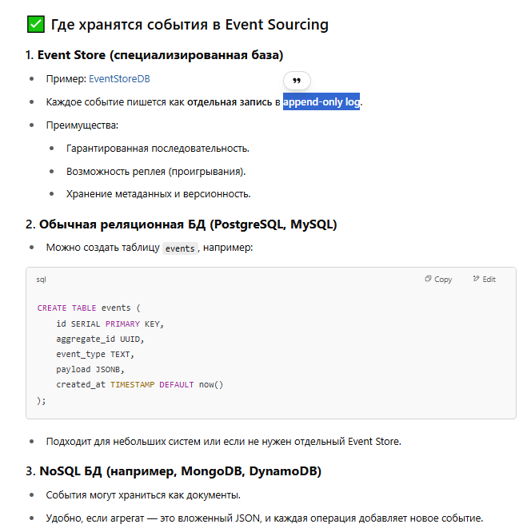

## 🧭 Версии Domain-Driven Design (DDD)

Когда говорят про «3-ю» и «4-ю» версии DDD (Domain-Driven Design), обычно имеют в виду **эволюцию подхода**, связанную с интеграцией событийной архитектуры.

---

### 📌 Что такое 3-я и 4-я версии DDD?

#### 🔖 3-я версия DDD (CQRS + События вторичны)

- Основывается на разделении команд и запросов (**CQRS — Command Query Responsibility Segregation**).
- События используются, но не являются первичным источником истины.
- Состояние агрегатов (объектов) — главный источник данных.

**Решает задачи:**

- Повышение производительности чтения.
- Чёткое разделение на чтение и запись.
- Масштабируемость чтения.

**Когда использовать?**

- Системы с преобладанием чтения.
- Онлайн-магазины, соцсети, каталоги.

Пример:

> Библиотека 📚:
>
> - **Запрос**: «Найди книгу» — пользователь вводит название или автора, и система обращается к специально подготовленной модели чтения (Read Model), которая уже содержит оптимизированные данные, например, индексы или кешированные результаты, чтобы выдать ответ мгновенно.
>
> - **Команда**: «Одолжить книгу» — пользователь нажимает кнопку «взять книгу», и система инициирует бизнес-логику: проверяет доступность, правила бронирования, сроки возврата и только потом вносит изменения в Write Model. Эта часть сложнее, потому что она должна быть надёжной и гарантировать консистентность данных.

---

#### 🔖 4-я версия DDD (Event Sourcing)

- Основывается на **событиях как источнике истины**.
- Вместо хранения текущего состояния — хранится история всех изменений.
- Состояние агрегата воссоздаётся при проигрывании всех событий.

**Решает задачи:**

- Хранение полной истории изменений.
- Возможность откатиться во времени (time-travel, audit).
- Простота интеграции через события.

**Когда использовать?**

- Банковские системы, бухгалтерия, логистика.
- Микросервисная архитектура, где события — способ коммуникации.

**Пример:**

> Банковский счёт 💳:
>
> - Каждое пополнение и списание — это событие.
> - Баланс = результат проигрывания всех событий.

---

## 🚦 Сравнение версий

| Критерий                 | 3-я версия (CQRS)   | 4-я версия (Event Sourcing)             |
| ------------------------ | ------------------- | --------------------------------------- |
| Источник истины          | Состояние агрегатов | События                                 |
| Хранение истории         | Ограничено          | Полное                                  |
| Уровень сложности        | Ниже                | Выше                                    |
| Использование событий    | Второстепенное      | Основное                                |
| Удобство масштабирования | Хорошее             | Труднее без дополнительных инструментов |

---

## 🧠 Что может сбивать с толку

- **События ≠ Event Sourcing** — не каждое использование событий означает Event Sourcing. В 3-й версии они используются как побочный эффект, в 4-й — это источник истины.
- **DDD ≠ CQRS ≠ Event Sourcing** — это разные паттерны. DDD — это про модель предметной области. Остальные — технические реализации.
- **Смешение подходов** — многие компании используют комбинацию CQRS + CRUD + частичный Event Sourcing, и это может путать.

---

## 🔗 Как связаны CQRS и события

- CQRS — это про **разделение команд и запросов**.
- Event Sourcing — это про **хранение истории изменений в виде событий**.
- Чаще всего Event Sourcing строится **поверх CQRS**, но можно использовать CQRS без Event Sourcing.

**Пример:**

```
Команда: PlaceOrder
→ Агрегат: Order применяет бизнес-логику
→ Событие: OrderPlaced сохраняется (если Event Sourcing)
→ Проекция обновляет Read Model (если CQRS)
```

---

## 🏢 Примеры компаний

### Используют 3-ю версию (CQRS без Event Sourcing):

- **Amazon** — для обработки каталогов, корзин и заказов важно быстрое чтение и масштабирование. Состояние заказов хранится централизованно, а события — лишь побочный эффект.
- **Instagram** — профили, комментарии, лента: акцент на массовое чтение, нет необходимости хранить каждое изменение с историей.
- **GitHub (основная модель)** — при обычном просмотре репозиториев, issues, PR используется CQRS для быстрого отклика и разделения операций на чтение и запись.

### Используют 4-ю версию (Event Sourcing):

- **EventStore** — база данных, специально созданная для хранения событий как источника истины.
- **Lufthansa Systems** — логистика и управление расписанием требуют возможности воспроизвести состояние на момент в прошлом.
- **UBS / Deutsche Bank** — Event Sourcing используется для учёта всех изменений по транзакциям, критично для аудита и регуляторных проверок.
- **Monobank** — активно применяет Event Sourcing для отслеживания истории операций, действий пользователей, push-уведомлений. Это позволяет делать откаты, полную аналитику и быстрый аудит. CQRS используется в интерфейсной части для раздельной работы со счётами, транзакциями и аналитикой.

> Большинство используют **комбинацию подходов** — CQRS для большинства сервисов, Event Sourcing — точечно для чувствительных операций.

---

## 🧭 Как выбрать подход?

**Используй 3-ю версию, если:**

- Нужно быстрое чтение данных.
- Проект небольшой или средний по сложности.
- Нет необходимости хранить каждое изменение.

**Используй 4-ю версию, если:**

- Важен полный аудит или история изменений.
- Сложная система с микросервисами.
- Требуется восстановление состояния на любой момент времени.

---

✅ **DDD не обязан быть событийным.** События — это просто расширение и дополнительный инструмент, а не обязательная часть DDD.


---

# 🧠 Разница между 3-й и 4-й версией DDD

## ✅ Правильное понимание

### 🔹 3-я версия (CQRS без Event Sourcing)

- Разделение:
  - **Команды** (`POST`, `PUT`, `DELETE`) — **меняют состояние** (Write Model).
  - **Запросы** (`GET`) — **читают данные** (Read Model).
- **События могут быть**, но они **вторичны**.
- Источник истины — **текущее состояние** в базе данных.

### 🔸 4-я версия (Event Sourcing)

- Команды **не меняют состояние напрямую**, а **генерируют события**.
- **События** — это **источник истины**.
- Состояние агрегатов восстанавливается из цепочки событий (`OrderCreated`, `OrderPaid`, `OrderShipped` и т.д.).
- **Запросы (`GET`) обращаются к проекциям**, собранным из событий.

---

## ❌ Распространённая ошибка

> “В 4-й версии события реагируют на команду **или запрос**”

Это **неверно**:

- ✅ События реагируют **на команды** (`POST`, `PUT`).
- ❌ **Запросы (`GET`) не вызывают события**, потому что не изменяют систему.

---

## 📌 Таблица сравнения

| Версия | Источник истины       | События                 | Команды (`POST` / `PUT`)         | Запросы (`GET`)              |
|--------|------------------------|--------------------------|----------------------------------|------------------------------|
| 3-я    | Состояние (БД)         | Побочный эффект (опционально) | Меняют напрямую состояние       | Читают Read Model            |
| 4-я    | События (Event Store)  | Главный механизм         | Генерируют события               | Читают проекции (Read Model) |

---

## 🔄 Пример (4-я версия):

```
Команда: PlaceOrder
→ Агрегат: Order
→ Применяется логика
→ Генерируется событие: OrderPlaced
→ Сохраняется в Event Store
→ Проекция обновляет Read Model
→ Пользователь видит обновление через GET
```

